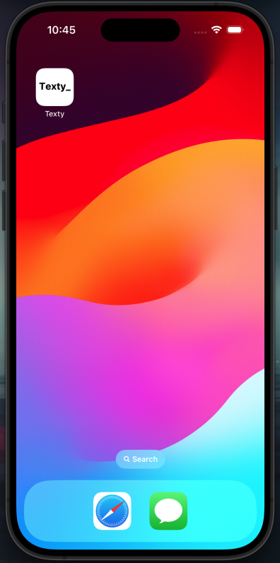
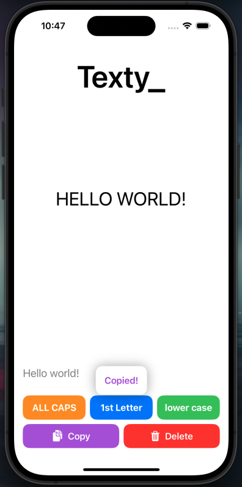

# Texty_ App

**Texty_** is a SwiftUI-based app designed to transform user input text into different formats and provide additional text management features.

## Features

- **Text Transformation**: Convert text to uppercase, capitalize the first letter, or convert to lowercase based on user selection.
- **Copy and Delete Functionality**: Copy transformed text to the clipboard or clear the text and clipboard.
- **Feedback**: Display a "Copied!" message when text is copied.

## UI Components

- **CustomButtonView**: A reusable button component with customizable title and color.
- **ContentView**: The main view of the app where text transformation and management features are provided.

## Installation

1. Clone the repository:
   ```bash
   git clone https://github.com/MartinFlischman/Texty.git

## Screenshots



